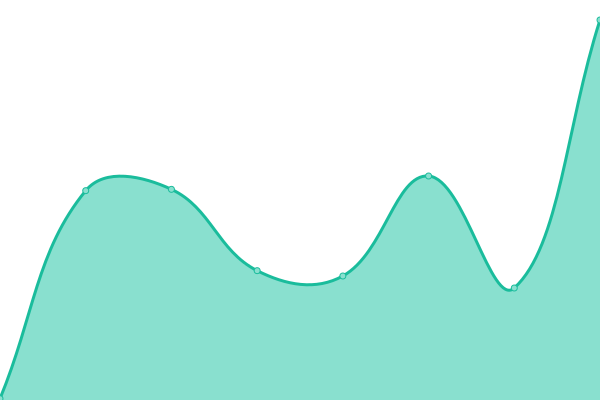
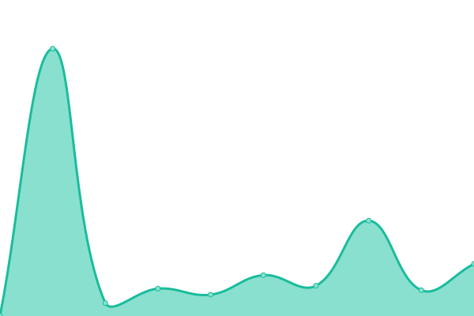
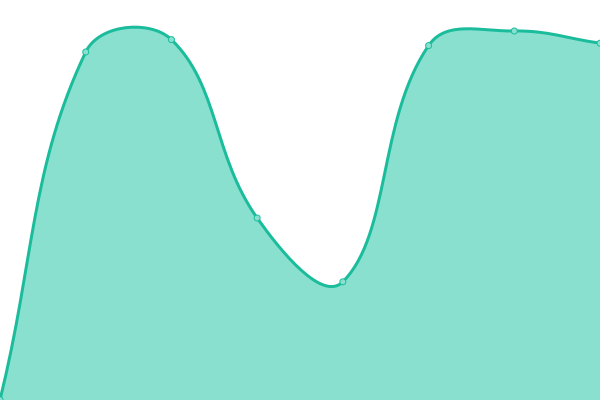
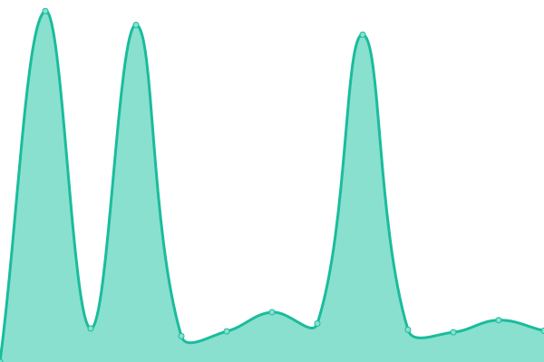

# [📈 Live Status](https://sahajananddigital.github.io/monitor): <!--live status--> **🟩 All systems operational**

This repository contains the open-source uptime monitor and status page for [Sahajanand Digital](https://sahajananddigital.in), powered by [Upptime](https://github.com/upptime/upptime).

With [Upptime](https://upptime.js.org), you can get your own unlimited and free uptime monitor and status page, powered entirely by a GitHub repository. We use [Issues](https://github.com/sahajananddigital/monitor/issues) as incident reports, [Actions](https://github.com/sahajananddigital/monitor/actions) as uptime monitors, and [Pages](https://sahajananddigital.github.io/monitor) for the status page.

<!--start: status pages-->
<!-- This summary is generated by Upptime (https://github.com/upptime/upptime) -->
<!-- Do not edit this manually, your changes will be overwritten -->
<!-- prettier-ignore -->
| URL | Status | History | Response Time | Uptime |
| --- | ------ | ------- | ------------- | ------ |
|  [Sahajananad Digital](https://sahajananddigital.in) | 🟩 Up | [sahajananad-digital.yml](https://github.com/sahajananddigital/monitor/commits/HEAD/history/sahajananad-digital.yml) | 

 156ms
     
 | 

<a href="https://sahajananddigital.github.io/monitor/history/sahajananad-digital">98.55%</a>
    

|  [Aquapex Ro](https://aquapexro.in) | 🟩 Up | [aquapex-ro.yml](https://github.com/sahajananddigital/monitor/commits/HEAD/history/aquapex-ro.yml) | 

 303ms
     
 | 

<a href="https://sahajananddigital.github.io/monitor/history/aquapex-ro">98.73%</a>
    

|  [Clear Books Kpo](https://clearbookskpo.com) | 🟩 Up | [clear-books-kpo.yml](https://github.com/sahajananddigital/monitor/commits/HEAD/history/clear-books-kpo.yml) | 

 342ms
     
 | 

<a href="https://sahajananddigital.github.io/monitor/history/clear-books-kpo">98.55%</a>
    

|  [Aquafinest Ro ( Gajanan Praskar )](https://aquafinestro.com) | 🟩 Up | [aquafinest-ro-gajanan-praskar.yml](https://github.com/sahajananddigital/monitor/commits/HEAD/history/aquafinest-ro-gajanan-praskar.yml) | 

 1728ms
     
 | 

<a href="https://sahajananddigital.github.io/monitor/history/aquafinest-ro-gajanan-praskar">99.08%</a>
    

|  [Evon Stone Ceramics ( USA )](https://evonceramics.com) | 🟩 Up | [evon-stone-ceramics-usa.yml](https://github.com/sahajananddigital/monitor/commits/HEAD/history/evon-stone-ceramics-usa.yml) | 

 2150ms
     
 | 

<a href="https://sahajananddigital.github.io/monitor/history/evon-stone-ceramics-usa">97.21%</a>
    

<!--end: status pages-->

[**Visit our status website →**](https://sahajananddigital.github.io/monitor)

## 📄 License

- Powered by: [Upptime](https://github.com/upptime/upptime)
- Code: [MIT](./LICENSE) © [Sahajanand Digital](https://sahajananddigital.in)
- Data in the `./history` directory: [Open Database License](https://opendatacommons.org/licenses/odbl/1-0/)
